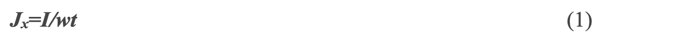
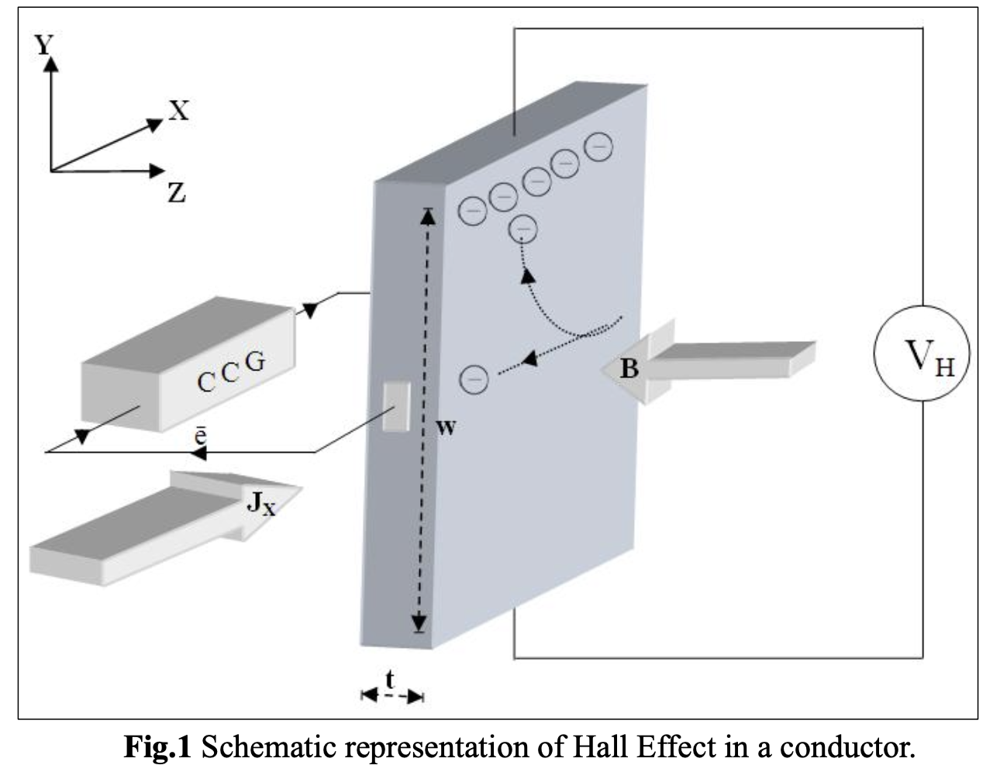
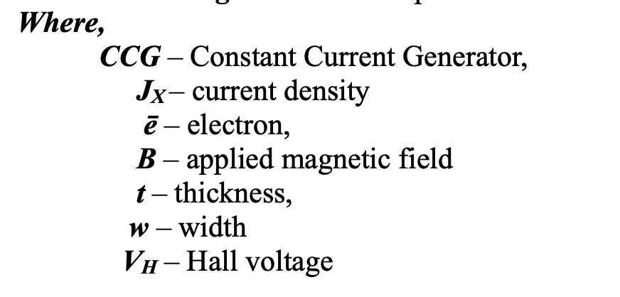
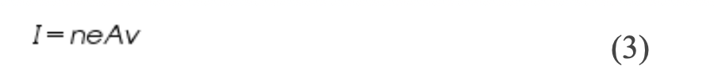
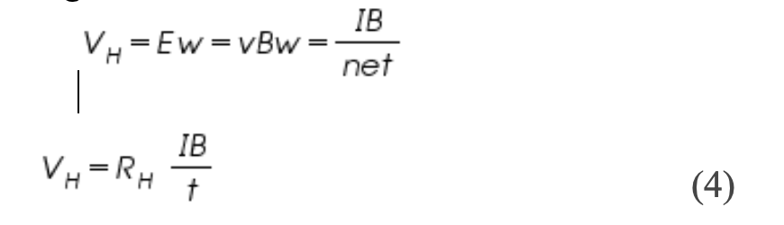
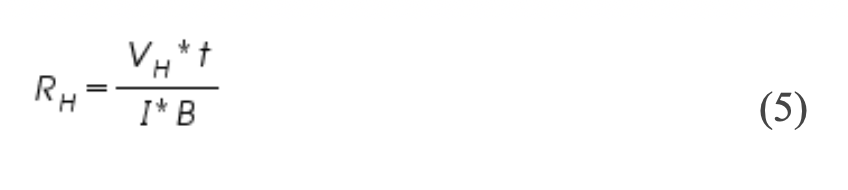
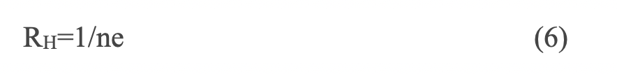

## Apparatus: 
Two solenoids, Constant current supply, four probe, Digital gauss meter, Hall effect apparatus (which consist of Constant Current Generator (CCG), digital milli voltmeter and Hall probe). 
 
## Theory	

If a current carrying conductor placed in a perpendicular magnetic field, a potential difference will generate in the conductor which is perpendicular to both magnetic field and current. This phenomenon is called Hall Effect. 

In solid state physics, Hall effect is an important tool to characterize the materials especially semiconductors. It directly determines both the sign and density of charge carriers in a given sample.

 

Consider a rectangular conductor of thickness t kept in XY plane. An electric field is applied in X-direction using Constant Current Generator (CCG), so that current I flow through the sample. If w is the width of the sample and t is the thickness. There for current density is given by 

If the magnetic field is applied along negative z-axis, the Lorentz force moves the charge carriers (say electrons) toward the y-direction. This results in accumulation of charge carriers at the top edge of the sample. This set up a transverse electric field Ey in the sample. This develop a potential difference along y-axis is known as Hall voltage VH and this effect is called Hall Effect.

 
A current is made to flow through the sample material and the voltage difference between its top and bottom is measured using a voltmeter. When the applied magnetic field B=0, the voltage difference will be zero.

We know that a current flows in response to an applied electric field with its direction as conventional and it is either due to the flow of holes in the direction of current or the movement of electrons backward. In both cases, under the application of magnetic field the magnetic Lorentz force, Fm= q (V*B)  causes the carriers to curve upwards. Since the charges cannot escape from the material, a vertical charge imbalance builds up. This charge imbalance produces an electric field which counteracts with the magnetic force and a steady state is established. The vertical electric field can be measured as a transverse voltage difference using a voltmeter.

In steady state condition, the magnetic force is balanced by the electric force. Mathematically we can express it as Where 'e' the electric charge, 'E' the hall electric field developed, 'B' the applied magnetic field and 'v' is the drift velocity of charge carriers.
And the current 'I' can be expressed as,

Where 'n' is the number density of electrons in the conductor of length l, breadth 'w' and thickness 't'.

Using (1) and (2) the Hall voltage VH can be written as,

by rearranging eq(4) we get

Where RH is called the Hall coefficient.

